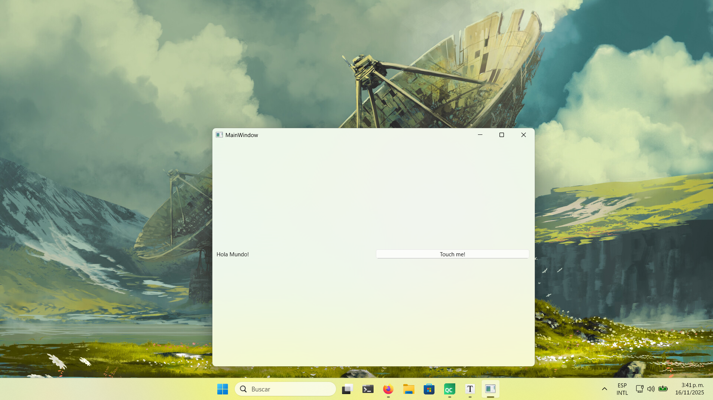
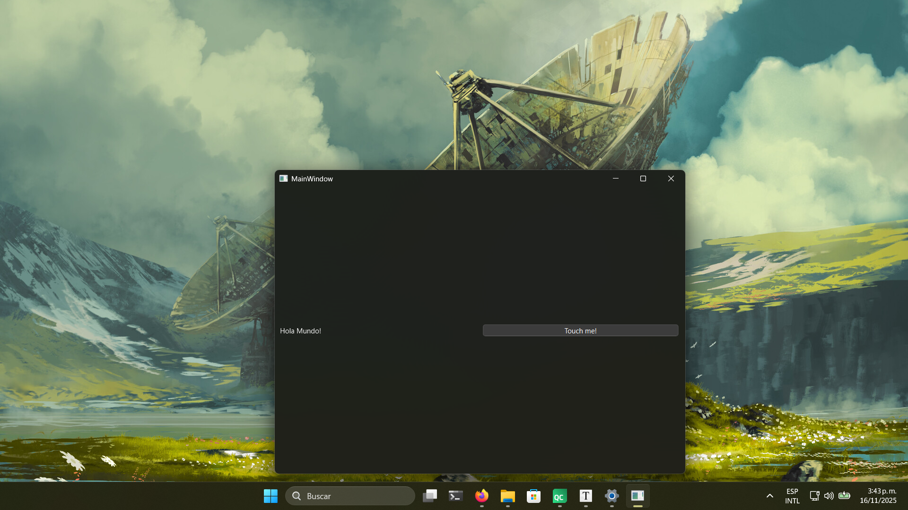
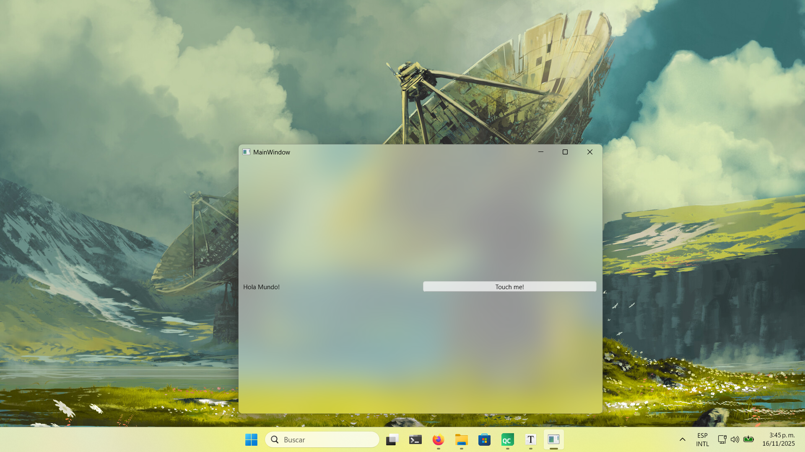
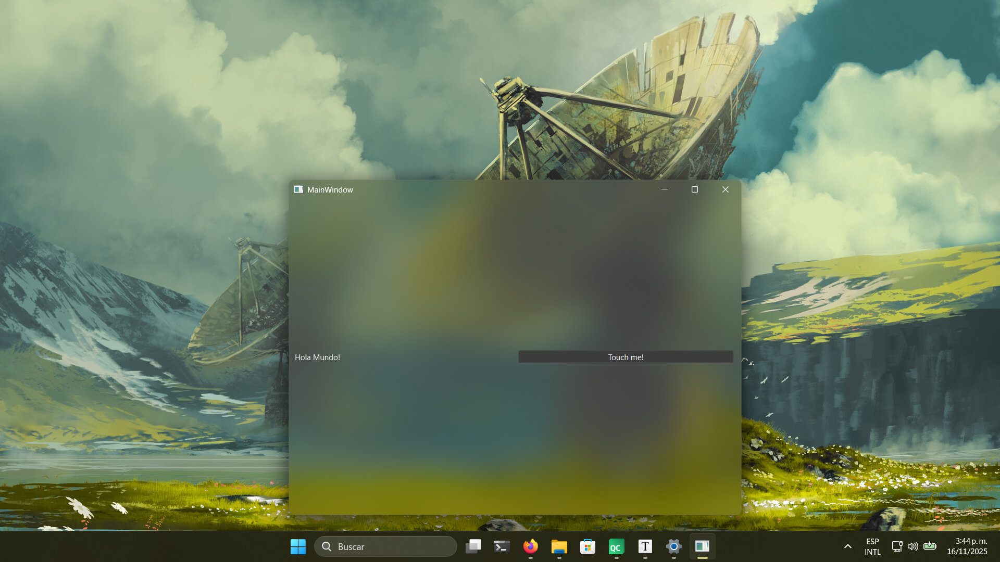

# Ejemplo de efecto Mica (y acrílico) usando QtWidgets en Windows! (C++)

Este repositorio, contiene un ejemplo en código replicable para aplicar efecto Mica y Acrílico a apps desarrolladas con Qt Widgets Frameworks, usando la API de Windows, esto es sumamente útil para un diseño nativo/moderno en apps para Windows desarrolladas con Qt

La documentación en internet disponible suele ser frustrante y confusa, espero que esto te ayude mucho como lo hizo conmigo.


## Cómo funciona?

Primero se añade el uso de las bibliotecas de windows y el gestor de ventanas de windows al proyecto, en este ejemplo, usamos CMake:

```cmake
if(WIN32)
    target_link_libraries(mica_example PRIVATE
        user32
        dwmapi
    )
```

Posteriormente, necesitamos detectar la versión de windows 11 usada, debido a que las primeras versiones tienen una forma un poco diferente de renderizar estos efectos es necesarios añadir la siguiente linea a la cabecera de nuestra aplicación, en este ejemplo, sería mainwindow.h :

```c++
#include <QOperatingSystemVersion>
```

Luego, en nuestro archivo principal de ventana, en este ejemplo vendería siendo mainwindow.cpp, tenemos que hacer que nuestra ventana sea translúcida y usar las APIs de windows para que obtenga el efecto que deseamos, en nuestro caso usamos `#ifdef Q_OS_WIN` para que estos bloques de código SOLO SE COMPILEN EN WINDOWS, de esa forma, si tu app es multiplataforma, no se verá afectada al compilarla en Linux/Mac/Android, ya que este efecto solo será usado en Windows.


```c++
#include <QSettings> //para editar el registro de windows

#ifdef Q_OS_WIN // solo válido para importar las APIs de Windows, en windows (lol).
#include <Windows.h> 
#include <WinUser.h>
#include <dwmapi.h>
#endif


const int DWMWA_MICA_EFFECT = 1029;

// Valores para el backdrop
const int DWMSBT_MICA = 2; // 2 Efecto Mica (native-like), 3 Acrylic (blur)


MainWindow::MainWindow(QWidget *parent) //código aburrido de Qt
    : QMainWindow(parent)
    , ui(new Ui::MainWindow)
{
    ui->setupUi(this);

    #ifdef Q_OS_WIN // Solo para windows, de esta forma no se verá afectada tu app al compilar para sistema.
    this->setAttribute(Qt::WA_TranslucentBackground); // queremos que nuestra ventana sea translúcida
    HWND hwnd = (HWND)this->winId(); // Obtenemos el identificador de nuestra ventana

    QOperatingSystemVersion version = QOperatingSystemVersion::current(); // Obtenemos la versión de Windows
    int build = version.microVersion(); // microVersion() es el número de build

    if (build < 22000) {
        return;
    }
    // Con esto, aseguramos que la app funcione correctamente en tema claro/oscuro de Windows
    QSettings settings("HKEY_CURRENT_USER\\Software\\Microsoft\\Windows\\CurrentVersion\\Themes\\Personalize", QSettings::NativeFormat);
    int appsUseLightTheme = settings.value("AppsUseLightTheme", 1).toInt();
    int isDark = (appsUseLightTheme == 0) ? 1 : 0;

    // Aplicamos los atributos con la API del gestor de ventanas de Windows
    DwmSetWindowAttribute(
        hwnd,
        DWMWA_USE_IMMERSIVE_DARK_MODE,
        &isDark, // 1 para oscuro, 0 para claro
        sizeof(isDark)
        );

    MARGINS margins = {-1}; // -1 = toda la ventana
    DwmExtendFrameIntoClientArea(hwnd, &margins);

    // Aplicar el efecto MICA (lógica de build) ---
    int backdropValue = DWMSBT_MICA; // 2

    if (build >= 22621) { // Si es 22H2 o más nuevo
        // Usar la API nueva (DWMWA_SYSTEMBACKDROP_TYPE)
        DwmSetWindowAttribute(
            hwnd,
            DWMWA_SYSTEMBACKDROP_TYPE, // Atributo 38
            &backdropValue,
            sizeof(backdropValue)
            );
    } else { // Si es 21H2 (el primer Win11)
        // Usar la API antigua (DWMWA_MICA_EFFECT)
        int micaValue = 1; // 1 = Habilitar
        DwmSetWindowAttribute(
            hwnd,
            DWMWA_MICA_EFFECT, // Atributo 1029
            &micaValue,
            sizeof(micaValue)
            );
    }
    #endif

}

MainWindow::~MainWindow()
{
    delete ui;
}

// el resto del código de tu app a partir de aquí :3
```


# Showcase


### Efecto "Mica" en tema claro/oscuro






### Efecto "Acrylic" en tema claro/oscuro






## Eso es todo :)

Espero que esto te sirva y te ahorre horas de busqueda sin exíto de como realizar esto. En mi experiencia y pruebas personales es incluso más estable/consistente/compatible comparado a hacerlo con Python (Pyqt/Pyside), en el cual también probé y existían varios errores visuales. Ademas, C++ es excelente si quieres desarrollar apps con Qt.


